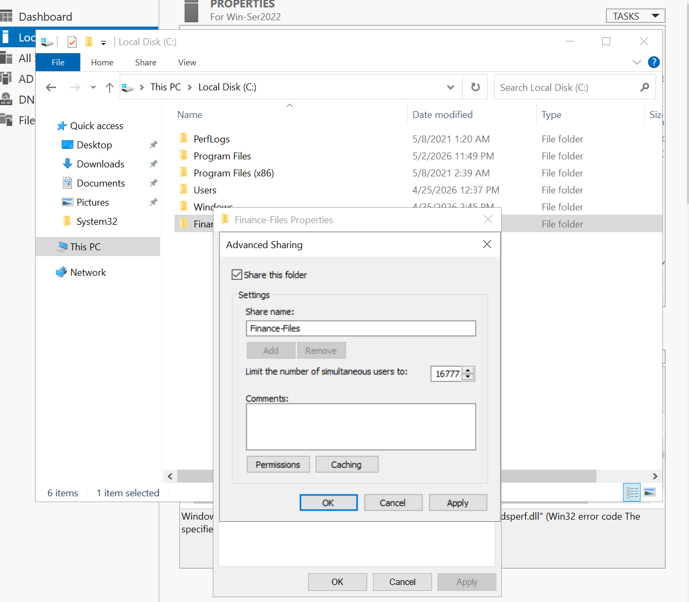
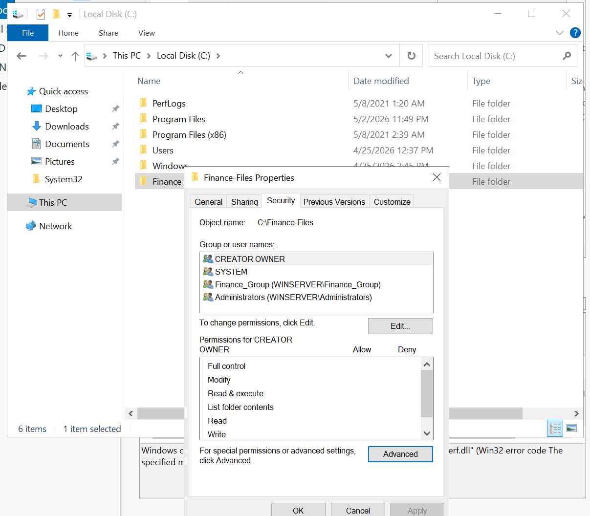

# Active Directory File Share & Permissions Lab

## Overview
In this project, I configured a secure file share in an Active Directory environment. The goal was to control access using security groups, remove inherited permissions, and validate access from a domain-joined client machine.

---

## Environment
- Windows Server 2022 (Domain Controller)
- Windows 10 (Client Machine)
- VMware Workstation
- Domain: WinServer.local

---

## Objective
- Create a shared folder (`Finance-Files`)
- Restrict access using an Active Directory group (`Finance_Group`)
- Remove inherited/default permissions
- Validate access from a client machine

---

## Step 1: Create Shared Folder

Created a folder on the domain controller:

C:\Finance-Files

---

## Step 2: Configure Share Permissions

Enabled folder sharing and assigned access to Finance_Group:

---

## Step 3: Review Default Permissions

Observed that inherited permissions were automatically applied:

---

## Step 4: Disable Inheritance

Disabled inheritance to gain full control over permissions:

---

## Step 5: Apply NTFS Permissions

Removed unnecessary groups and added Finance_Group with proper access:

Final permissions:
- Finance_Group → Read / Modify
- Administrators → Full Control
- SYSTEM → Full Control

---

## Step 6: Access Testing

### Unauthorized Access

User outside Finance_Group was denied access:

---

### Authorized Access

User in Finance_Group successfully accessed the shared folder:

---

## Key Takeaways

- NTFS permissions and Share permissions must both be configured correctly
- Inheritance can introduce unintended access risks
- Active Directory groups simplify access management
- Testing from a client machine is critical for validation
- Proper permissions configuration prevents unauthorized access
