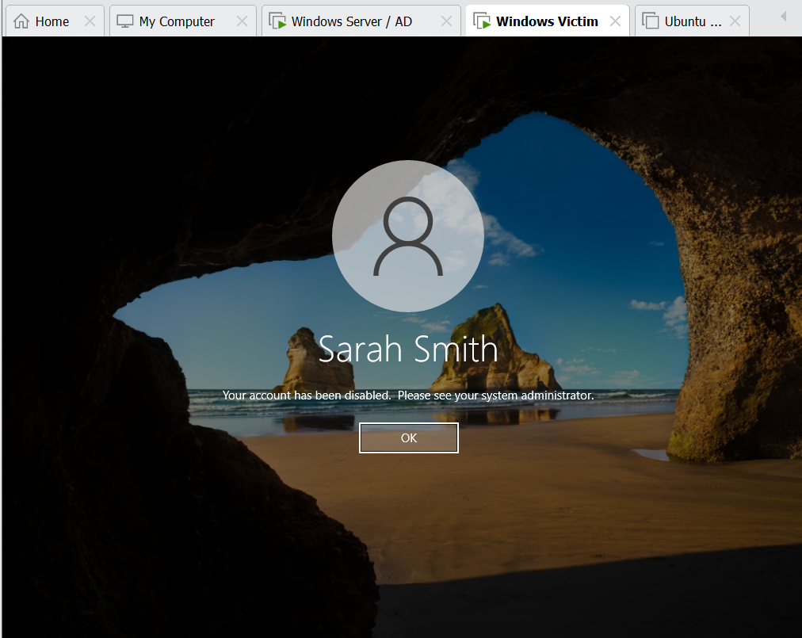
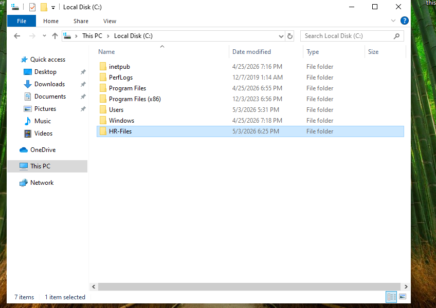
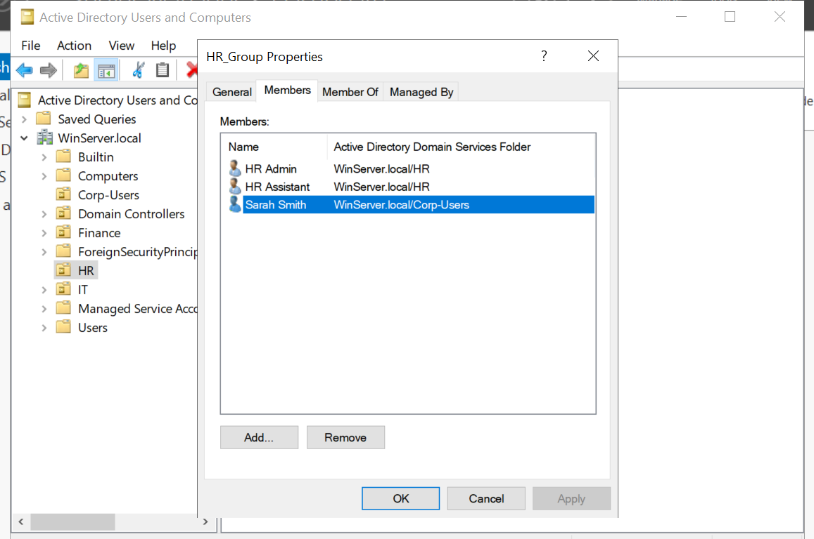

# Active Directory Home Lab: User Management & Access Control

## Overview

I built a virtual Active Directory home lab to simulate real-world help desk tasks. This project focuses on user management, authentication, and troubleshooting access control issues in a domain environment.

---

## Objective

The goal of this lab was to gain hands-on experience handling common IT support scenarios such as account lockouts, password resets, and resolving permission issues using Active Directory and NTFS permissions.

---

## Environment

* Windows Server (Domain Controller)
* Windows Client (Domain-joined machine)
* Active Directory Users & Computers (ADUC)
* Domain: WinServer.local

---

## Initial Setup

* Created domain users (ssmith, mbrown)
* Joined client machine to the domain
* Verified domain authentication using `whoami`

---

## Scenario 1: Account Lockout & Password Reset

### Problem

User was unable to log in due to account being disabled.

---

### Action Taken

* Located user in Active Directory
* Enabled the account

---

### Result

User was able to successfully log in after account was restored.

---

## Scenario 2: User Access Troubleshooting

### Setup

Created a test directory to simulate restricted access:

---

## Scenario 3: Group-Based Access Control & Permission Troubleshooting

### Problem

A user (mbrown) who was NOT part of the HR group was still able to access a restricted folder.

---

### Investigation

* Reviewed NTFS permissions
* Identified inherited permissions allowing unintended access

---

### Resolution

* Disabled inheritance  
* Converted inherited permissions into explicit permissions  
* Removed broad access groups  
* Assigned access only to `HR_Group`  

---

### Validation

#### Unauthorized Access Blocked

User outside HR group was denied access:

---

#### Authentication Control Verified

Disabled user could not log in:

---

## Key Takeaways

* Learned how NTFS permission inheritance can unintentionally grant access  
* Reinforced the importance of least privilege  
* Gained experience troubleshooting real-world access control issues  
* Understood why organizations use group-based permissions instead of assigning access directly to users  

---

## Reflection

This lab helped me better understand how access control works in a domain environment. It also showed me how small permission misconfigurations can lead to security issues and how to properly troubleshoot and resolve them.

---

## Skills Demonstrated

* Active Directory user management  
* Domain authentication  
* NTFS permissions  
* Access control troubleshooting  
* Group-based access control (RBAC)
